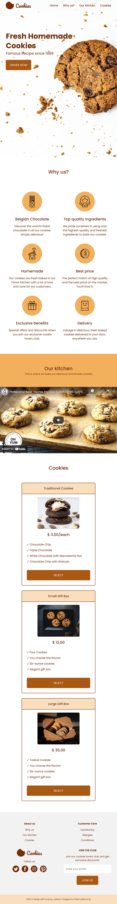

# FreeCodeCamp - Product Landing Page

Project created for the Responsive Web Design Certification from <a href="https://www.freecodecamp.org/learn">freeCodeCamp</a>.

Project 3/5: <a href="https://www.freecodecamp.org/learn/responsive-web-design/responsive-web-design-projects/build-a-product-landing-page">Build a Product Landing Page</a>

## Technologies

- HTML/CSS

## Table of contents

- [Layout](#layout) 
- [My process](#👩🏻‍💻-my-process)
  - [Built with](#built-with)
  - [What I learned](#what-i-learned)

## Layout

### Web 🖥️

 <br/>

### Tablet 📱

 <br/>

### Mobile 📱

 <br/><br/>

## 👩🏻‍💻 My process

### Built with

- Semantic HTML5 markup
- CSS custom properties
- CSS Flexbox

### What I learned

- How to create responsive `iframe` with CSS that will keep the aspect ratio when resized:

1) HTML: Use a container, like `<div>`, and add the `iframe` inside of it;
2) CSS: Add a percentage value for padding-top to maintain the aspect ratio of the container. To create an aspect ratio of 16:9, which is the default aspect ratio of YouTube videos, use `padding-top: 56.25%` (for 16:9 aspect ratio, divide 9 by 16 = 0.5625);
3) CSS: Style the `iframe` to fit the container with full height and width.


```css
.video-wrapper {
  position: relative;
  overflow: hidden;
  width: 100%;
  padding-top: 56.25%;
}

.video {
  position: absolute;
  top: 0;
  left: 0;
  bottom: 0;
  right: 0;
  width: 100%;
  height: 100%;
  border: 0;
}
```

Source: <a href="https://www.w3schools.com/howto/howto_css_responsive_iframes.asp">W3Schools</a>
<br/><br/>

- Stacking without the z-index property

When the `z-index` is not specified on any element, elements are stacked in the following order (from bottom to top):

1) Background and borders of the root element;
2) Descendant non-positioned blocks, in order of appearance in the HTML;
3) Descendant positioned elements, in order of appearance in the HTML;

The `header` in this project is positioned with `position: fixed` so it's on top of all other non-positioned elements, but the `z-index` was still needed to make sure the `header` always stays on top, because of other positioned elements that appear after it in the HTML, like `<section class="hero-section">` and `<iframe>` for example.

Source: <a href="https://developer.mozilla.org/en-US/docs/Web/CSS/CSS_Positioning/Understanding_z_index/Stacking_without_z-index">MDN Web Docs</a>
<br/><br/>

- Aligning with auto margins in a flex container

Auto margins can be used to align an individual flex item along the main axis in a flex container. In this project `margin-top: auto` was used to align the `<a>` inside the `<div class="cookies-item">` in the Cookies section. The `auto` margin applies only to the flex item and align that one flex item within the container.

Robin Rendle from <a href="https://css-tricks.com/the-peculiar-magic-of-flexbox-and-auto-margins/">CSS Tricks</a> says:

> "Setting the margin property on a flex child will push the child away from that direction. Set margin-left to auto, the child will push right. Set margin-top to auto and the child will push to the bottom."

According to the <a href="https://www.w3.org/TR/css-flexbox-1/#auto-margins">W3C Recommendation</a>, `margin: auto` prevails over `justify-content` and `align-self`: 
>Prior to alignment via justify-content and align-self, any positive free space is distributed to auto margins in that dimension.
>If free space is distributed to auto margins, the alignment properties will have no effect in that dimension because the margins will have stolen all the free space left over after flexing.

<br/>

- Changing SVGs color with CSS `filter`

1) Add the SVG image using an `` tag;
2) To filter to a specific color, use <a href="https://codepen.io/sosuke/pen/Pjoqqp">this Codepen</a> to convert a hex color code to a CSS filter;
3) Add the CSS filter to the `` class.

In this project this technique was used to change the color of the social media icons in the footer. The target color was `#732c02` and this was the result filter:

```css
filter: invert(14%) sepia(57%) saturate(4116%) hue-rotate(27deg) brightness(96%) contrast(98%);
```
Source: <a href="https://stackoverflow.com/questions/22252472/how-to-change-the-color-of-an-svg-element">Stack Overflow</a>
<br/><br/>

- Responsive images in CSS using `image-set()`

According to <a href="https://developer.mozilla.org/en-US/docs/Web/CSS/image/image-set()">MDN</a>:
>The image-set() CSS functional notation is a method of letting the browser pick the most appropriate CSS image from a given set, primarily for high pixel density screens.

The image-set() is used to provide alternative `background-image` options, with different resolutions, that will be chosen by the browser depending on the resolution needed, it's similar to how `srcset` works. 

```css
.hero-section {
    background-image: url(assets/cookies-mobile-450px@1x.jpg);
    background-image: -webkit-image-set(
      url(assets/cookies-mobile-450px@1x.jpg) 1x,
      url(assets/cookies-mobile-450px@2x.jpg) 2x,
      url(assets/cookies-mobile-450px@3x.jpg) 3x
    );
    background-image: image-set(
      url(assets/cookies-mobile-450px@1x.jpg) 1x,
      url(assets/cookies-mobile-450px@2x.jpg) 2x,
      url(assets/cookies-mobile-450px@3x.jpg) 3x
    );
  }
```

In this case, it was provided 3 images with different resolutions (1x, 2x, 3x) and the browser will pick the most appropriate for the device and settings. 

The spec is still in draft: <a href="https://drafts.csswg.org/css-images-4/#image-set-notation">W3C Editor's Draft - CSS Images Module Level 4</a>

Chris Coyler from CSS Tricks has a <a href="https://css-tricks.com/responsive-images-css/">great article about responsive images in CSS.</a> 

<br/>

***
##### Made with 💜 by Juliana Chagas 
